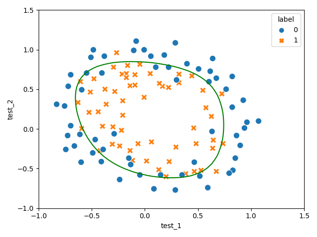

[](https://classroom.github.com/online_ide?assignment_repo_id=10072696&assignment_repo_type=AssignmentRepo)
# Instructions

⚠️

* **Do not modify the `tests` folder! It may cause errors and hence a decrease in your grading.**

* **Do not modify function names, variable names, or important code logic if you're not instructed to do so in README or
  directly in code comments or docstring. It may cost you a decrease in your grade.**

* **Add, modify or delete only those code parts which are either instructed by README, comment, or docstring,
  or they are intentionally left blank (added placeholders `pass`, `...`, `None`) for you to fill.**

* **Problem specific instructions are done via comments, read them, also pay more attention on TODO comments**

*Functions usually return values, if the instructor wants you to print something, it will directly be instructed in the
code, either by comment, or placeholder, or there will be a `print` function in the code*

### Recommendation

It's recommended to use different virtual environments for different projects (HWs).
You can always find list of [required libraries](requirements.txt) in your HW directory.
You may install requirements before solving your projects, it will increase your chances for having working code:

```shell
pip install -r requirements.txt
```

Happy coding 🧑‍💻.

# Problem statements

## Problem 1

[feature engineering](features_engineering.py)  **POINTS: 30**

In this homework, you will be working with a dataset of two test scores (test_1 and test_2) and the corresponding
label of either being accepted or rejected.
The goal is to fit a logistic regression model to this data, and visualize the decision boundary.

To begin with, the data will be plotted to see the initial points (function is written for you).
You will notice that the data points are not linearly separable in 2-D.

One way to fit the data better is to create more features from each data point.
This is achieved by mapping the features into all polynomial terms of test_1 and test_2 up to the **n**th power.
As a result of this mapping, our vector of two features will be transformed into a **(n + 1) * (n + 2) / 2**-dimensional
vector.

For example for `degree=2` we will have this formula:

```shell
1+x1+x2+x1x2+x1^2+x2^2
```

For `degree=1`:

```shell
1+x1+x2
```

I hope you do get what formula you will get for `6`. In this case we will have 28 dimensional vector.

#### Tasks

* Fill in the `map_feature` function in the code. The function `map_feature` should map the input features x1 and x2
  into all polynomial terms of x1 and x2 up to the given degree. **POINTS: 15**
* Train the logistic regression model and visualize the decision boundary by running the code. **POINTS: 5**
* Explain your results for different degrees, report accuracy metrics (use `sklearn.metrics`). Write this part in
  **jupyter notebook** (you should create your file for this), import
  functions from [feature engineering.py](features_engineering.py), the better you explain your results (plots) the more
  points you get. **POINTS: 10**

##### Hint

You will get this plot for `degree=6`:



## Problem 2

[logistic regression](logistic_regression.py)  **POINTS: 70**

Your task is to implement logistic regression on [diabets](data/diabetes.csv) data, to predict diabets `outcome`.
Fill in blank parts to finish function implementations.

Open a new jupyter notebook, explore your data, do EDA, explain your features and target.
Call your custom `CustomLogitsticRegression` class in jupyter notebook, run on diabets data, report accuracy score.
Try calculating accuracy score via pure python (without using any other libs) and from sklearn.

Compare your accuracy score with sklearn's logistic regression, you should get close results.

With codes in jupyter notebook also use explanations and comments. When you do EDA, don't make heavy plots, keep the
file small. 

